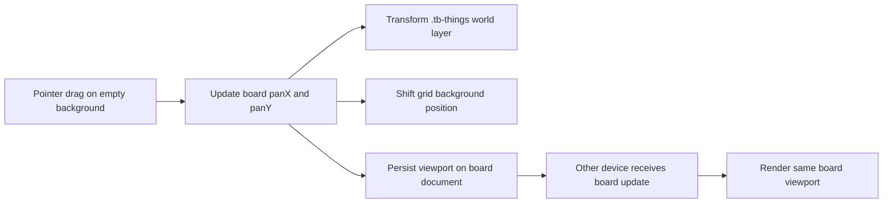

# Synced Infinite Canvas Future Implementation Guide

**Status:** Future feature, not implemented yet  
**Last updated:** 2026-06-01  
**Target complexity:** Medium  
**Recommended sync model:** Per-board, cross-device InstantDB state

## Summary

Thingboard currently supports moving individual cards around a fixed viewport. The next step toward an infinite canvas is to make the board viewport itself pannable: the user should be able to click empty background space and drag the board so all cards and the grid move together.

The desired behavior is not only local panning. The viewport position should be synced per board across devices, so opening the same board on another device should restore the same canvas view. This can be built with the current stack: Torus, plain DOM pointer events, CSS transforms, local CSS variables, and InstantDB.

## Current State

The current implementation stores each card's `x` and `y` directly on `things` records and renders each card with a CSS transform in `src/main.js`.

```js
style="transform: translate(${x + this.tempX}px,${y + this.tempY}px)"
```

The board viewport is fixed to the browser window in `public/main.css`.

```css
.tb-board {
  height: 100vh;
  width: 100vw;
  overflow: hidden;
}
```

There is no board-level viewport state yet. In other words, the app has card coordinates, but it does not yet have a camera or viewport offset.

## Target Behavior

- Dragging empty board background pans the canvas.
- Cards, selection UI, and the dot grid visually move together during panning.
- Dragging a card still moves only that card.
- Interacting with textareas, buttons, selects, menus, and the floating add button must not start panning.
- The active board's pan position is synced through InstantDB and restored across devices.
- Each board has its own independent pan position.
- New cards should appear in the visible viewport, but their saved coordinates should be stored in board/world space.
- The implementation should not introduce a pan/zoom dependency unless the feature grows to include zoom, minimaps, gestures, or complex selection.

## Mental Model

Use a simple camera model:

```text
screen position = world position + viewport pan
world position  = screen position - viewport pan
```

Cards should remain stored in world coordinates. Panning should update only the board viewport state.



## Data Model

Extend the existing `boards` collection with viewport fields:

```js
{
  name: "Main Board",
  createdAt: 1710000000000,
  updatedAt: 1710000000000,
  panX: 0,
  panY: 0,
  viewportUpdatedAt: 1710000000000
}
```

Recommended field behavior:

- `panX`: number, horizontal viewport offset in pixels.
- `panY`: number, vertical viewport offset in pixels.
- `viewportUpdatedAt`: number, timestamp used for debugging and possible conflict resolution.

Do not add `panX` or `panY` to individual `things`. Card coordinates should remain independent from viewport coordinates.

## Sync Strategy

Since the user wants cross-device sync, store pan state on each `boards` document in InstantDB.

Recommended approach:

1. During drag, update local component state every pointer move for smooth rendering.
2. Do not write to InstantDB on every pointer move.
3. Debounce or commit the final pan position on pointer up.
4. Optionally commit every 300-500ms during long drags if multi-device live-following is desired.

Preferred initial behavior:

- Local drag is immediate.
- Remote sync happens on pointer up.
- Other devices update after the pan gesture completes.

This avoids excessive cloud writes and keeps the implementation simple.

## Conflict Behavior

Because pan position is shared per board, two devices dragging the same board at the same time can conflict. For the first implementation, use last-write-wins, which matches the current simple app model.

Acceptable v1 behavior:

- Device A pans the board.
- Device B pans the same board.
- The most recent write to `panX` and `panY` wins.

Future improvement:

- Track `viewportUpdatedBy` or device/session ID.
- Ignore remote viewport updates while the local device is actively panning.
- Show a subtle "viewport updated elsewhere" notice if needed.

## UI Event Rules

Panning should start only from empty board space.

Suggested guard:

```js
function isPanStartTarget(target) {
  return target.closest('.tb-header, .tb-thing, .tb-fab, button, textarea, select, a') === null;
}
```

Use Pointer Events instead of separate mouse and touch handlers:

- `pointerdown` on `.tb-board`
- `pointermove` on captured pointer
- `pointerup` / `pointercancel`
- `setPointerCapture(pointerId)` for reliable drag tracking

CSS should set `touch-action: none` on the pannable background so touch dragging does not scroll or zoom the page unexpectedly.

## Rendering Plan

The cleanest rendering model is to transform a single world layer instead of changing every card during pan.

Recommended DOM shape:

```html
<div class="tb-board">
  <header class="tb-header">...</header>
  <div class="tb-world" style="transform: translate(panX, panY)">
    <div class="tb-things">...</div>
  </div>
  <button class="tb-fab">+</button>
</div>
```

In practice, `tb-world` may be optional if `.tb-things` itself can safely receive the transform. A separate wrapper is clearer if future features add selection boxes, connection lines, or other world-space elements.

## Grid Behavior

For the infinite canvas illusion, the grid must move with the world.

Options:

1. Apply the grid to `.tb-world`.
2. Keep the grid on `.tb-board`, but update `background-position` from `panX` and `panY`.

Recommendation:

Use `.tb-board` background variables because the board already owns the viewport.

```css
.tb-board {
  background-position: var(--tb-pan-x, 0px) var(--tb-pan-y, 0px);
}
```

The theme CSS currently paints some grids on `html[data-theme="..."]`. For panning, move theme grid definitions to `.tb-board` or mirror the relevant theme variables there, otherwise the cards may pan while the dots remain fixed.

## Coordinate Conversion

All card coordinates should remain world coordinates.

When creating a new card in the center of the visible viewport:

```js
const worldX = window.innerWidth / 2 - panX - cardWidth / 2;
const worldY = window.innerHeight / 2 - panY - cardHeight / 2;
```

When stacking cards in the visible viewport, subtract the current pan values from the intended screen positions before saving the card coordinates.

Card dragging can remain mostly unchanged because the card's own `x` and `y` are still world coordinates. Pointer deltas are the same in screen and world space while zoom is not implemented.

## Implementation Outline

### 1. Board Viewport State

Add state to `Board` in `src/main.js`:

- `this.panX`
- `this.panY`
- `this.isPanning`
- `this.panStartX`
- `this.panStartY`
- `this.panOriginX`
- `this.panOriginY`

Initialize `panX` and `panY` from the active board record, defaulting to `0`.

### 2. Board Sync

Update `syncFromRemote` or `switchBoard` so the active board's `panX` and `panY` are loaded when the active board changes.

Add a helper similar to:

```js
updateActiveBoardViewport(panX, panY) {
  safeTransact(
    db.tx.boards[this.activeBoardId].update({
      panX,
      panY,
      viewportUpdatedAt: Date.now(),
    }),
    'update viewport'
  );
}
```

### 3. Pointer Event Handling

Add board-level handlers:

- `handleBoardPointerDown`
- `handleBoardPointerMove`
- `handleBoardPointerUp`
- `handleBoardPointerCancel`

Start panning only when the target is empty board space.

During move:

```js
this.panX = this.panOriginX + (evt.clientX - this.panStartX);
this.panY = this.panOriginY + (evt.clientY - this.panStartY);
this.render();
```

On pointer up, persist the final pan values to InstantDB.

### 4. Render World Transform

Apply pan to a world layer:

```js
style="transform: translate(${this.panX}px, ${this.panY}px)"
```

The world layer should not include the fixed header or floating add button.

### 5. Create Card In Viewport

Update the `+` button so new cards are created near the visible center, translated into world coordinates.

### 6. Stack In Viewport

Update the `stack` button so cards stack in visible screen space after subtracting `panX` and `panY`.

### 7. Theme Grid Alignment

Move or duplicate grid background styles so `.tb-board` can shift background position with pan. Check all themes:

- default
- blueprint
- linen
- terminal

## Files Likely To Change

| File | Expected Changes |
| --- | --- |
| `src/main.js` | Add pan state, pointer handlers, board viewport sync, create/stack coordinate conversion |
| `public/main.css` | Add board/world cursor styles, touch-action rules, panning class styles |
| `public/themes.css` | Move grid rendering from `html[data-theme]` to board-aware styles or CSS variables |
| `src/board-state.mjs` | Optional helpers for board viewport defaults or normalization |
| `src/board-state.test.mjs` | Tests for viewport normalization if helpers are added |
| `README.md` | Optional note after implementation |

## Testing Plan

Manual checks:

- Dragging empty background pans the board.
- Dragging a card still moves only that card.
- Typing in a textarea does not pan the board.
- Clicking header controls, board menu, theme selector, links, and `+` does not pan.
- New cards appear in the visible viewport after panning far away from origin.
- Stack button places cards in the visible viewport.
- Switching boards restores each board's own pan.
- Opening the same board in two browsers/devices restores synced pan.
- Remote pan updates do not interrupt an active local card drag.

Automated tests worth adding:

- Screen-to-world coordinate conversion.
- Board viewport defaulting when `panX` or `panY` is missing.
- Active board viewport selection when switching boards.

Example helper tests:

```js
import assert from 'node:assert/strict';

function screenToWorld(screenX, screenY, panX, panY) {
  return { x: screenX - panX, y: screenY - panY };
}

assert.deepEqual(screenToWorld(500, 300, 100, -50), { x: 400, y: 350 });
```

## Risks And Decisions

| Topic | Recommendation |
| --- | --- |
| Sync frequency | Persist on pointer up first; add throttled live sync later only if needed |
| Conflict model | Last-write-wins for v1 |
| Persistence location | `boards` collection, not localStorage |
| Dependency choice | No new dependency for v1 |
| Zoom | Keep out of scope until panning is solid |
| Grid rendering | Move grid ownership to board/world styles so it can pan |

## Complexity Assessment

This is a medium-complexity feature.

The basic interaction is straightforward, but there are several integration details:

- Existing card dragging must keep working.
- Board controls must not trigger panning.
- Card creation must convert screen coordinates to world coordinates.
- Theme grid backgrounds currently live partly on `html`, which makes them visually fixed.
- Synced viewport state introduces a simple multi-device conflict case.

Estimated effort:

- Local-only pan: 1-2 hours.
- Synced per-board pan with grid alignment and coordinate conversion: 4-8 hours.
- Synced pan plus zoom, minimap, gestures, or live collaborative viewport indicators: 1-2+ days.

## Out Of Scope For First Implementation

- Zooming.
- Pinch gestures.
- Minimap.
- Multi-select.
- Infinite card virtualization.
- Connection lines between cards.
- Presence indicators showing where other devices are looking.

These can be layered on later if the board grows beyond simple notes.

